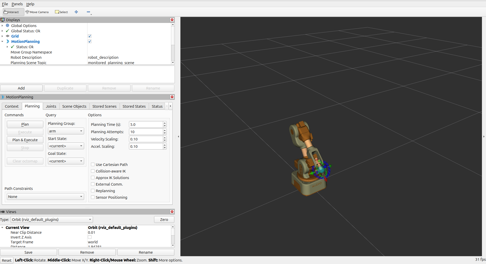
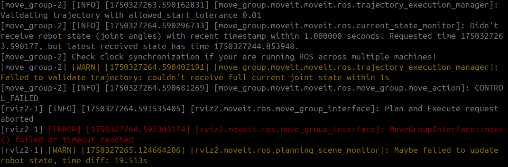

# Niryo NED ROS2 Driver

A ROS2 driver package that bridges ROS1 interfaces on Niryo NED robots to ROS2 interfaces, enabling seamless integration with modern ROS2 applications while maintaining compatibility with the robot's ROS1-based control system.

[](https://github.com/astral-sh/ruff)
[](LICENSE)

- [Niryo NED ROS2 Driver](#niryo-ned-ros2-driver)
  - [Overview](#overview)
  - [System Architecture](#system-architecture)
    - [Design Philosophy](#design-philosophy)
    - [Components](#components)
    - [Communication Flow](#communication-flow)
  - [Installation](#installation)
    - [Prerequisites](#prerequisites)
    - [Building from Source](#building-from-source)
  - [Usage](#usage)
    - [Using the Launch File](#using-the-launch-file)
      - [Configuring Robot Connections](#configuring-robot-connections)
      - [Launching the driver](#launching-the-driver)
      - [Interface whitelisting](#interface-whitelisting)
        - [Settings whitelists via command line](#settings-whitelists-via-command-line)
        - [Using a Whitelist YAML File](#using-a-whitelist-yaml-file)
        - [Whitelist behavior](#whitelist-behavior)
    - [Running the node directly](#running-the-node-directly)
    - [Verify connections](#verify-connections)
  - [Interfaces](#interfaces)
    - [Topics](#topics)
    - [Services](#services)
    - [Actions](#actions)
  - [Moveit2 integration](#moveit2-integration)
    - [Launching the Moveit2 package](#launching-the-moveit2-package)
    - [Caveat](#caveat)
  - [Limitations](#limitations)
  - [Troubleshooting](#troubleshooting)
    - [Common Issues](#common-issues)
      - [1. **Cannot connect to ROSBridge server**:](#1-cannot-connect-to-rosbridge-server)
      - [2. **Topics/services not appearing in ROS2**:](#2-topicsservices-not-appearing-in-ros2)
      - [3. **Moveit2 timing error**](#3-moveit2-timing-error)
  - [License](#license)
  - [Acknowledgments](#acknowledgments)


## Overview

The `niryo_ned_ros2_driver` package provides a bridge between ROS1 and ROS2, allowing ROS2 clients to communicate with the Niryo NED robot which runs on ROS1. This driver handles:

- Topic mapping between ROS1 and ROS2
- Service mapping between ROS1 and ROS2
- Action mapping between ROS1 and ROS2
- Special handling for TF transformations
- Multiple robot connections

## System Architecture

### Design Philosophy

The driver is designed with these principles in mind:

1. **Transparency**: Almost each ROS1 interface has a corresponding ROS2 interface with the same name and functionality. Interfaces that have no equivalent on the ROS2 side are blacklisted.
2. **Efficiency**: Only subscribed interfaces are bridged to minimize network traffic.
3. **Configurability**: Interfaces can be filtered based on user-defined whitelists.

### Components

The package consists of these main components:

- **ROS2Driver**: Main class that handles connection to the robot and interface registration.
- **Topic**: Maps ROS1 topics to ROS2 topics (and vice versa).
- **Service**: Maps ROS1 services to ROS2 services.
- **Action**: Maps ROS1 actions to ROS2 actions.
- **StaticTFTopic**: Special handler for static TF transformations.

### Communication Flow

```
ROS2 Client ↔ niryo_ned_ros2_driver (Remote computer) ↔ ROSBridge Server (Robot side) ↔ Niryo NED Robot stack (ROS1)
```

Messages and requests pass through this chain in both directions, with appropriate message type conversions handled by the driver.

## Installation

### Prerequisites

The driver has been tested on this setup:
- ROS2 Jazzy Jellyfish
- Python 3.12.3

It should work seemlessly with older version of ROS2. If it is not the case, don't hesitate to contact us.

### Building from Source

1. Create a ROS2 workspace:
   ```bash
   mkdir -p ~/ros2_drivers_ws/src
   cd ~/ros2_drivers_ws/src
   git clone https://github.com/NiryoRobotics/ned-ros2-driver.git
   ```

2. Install dependencies:
   ```bash
   cd ~/ros2_drivers_ws
   rosdep install --from-paths src --ignore-src -r -y
   ```

3. Create a Python virtual environment (recommended):
   ```bash
   python3 -m venv venv --system-site-packages
   source venv/bin/activate
   pip install -r src/requirements.txt
   ```

4. Build the package:
   ```bash
   source /opt/ros/jazzy/setup.bash
   colcon build
   ```

## Usage

The ROS2 driver can be used either through the provided launch file or by directly running the node. The driver is designed to connect to one or multiple Niryo robots simultaneously.

### Using the Launch File

The launch file provides a convenient way to start one or more driver instances with customizable parameters.

#### Configuring Robot Connections

The driver uses a YAML configuration file to specify which robots to connect to. The default location is `config/drivers_list.yaml`:

```yaml
rosbridge_port: 9090
robot_namespaces:
  - "robot1"
  - "robot2"
robot_ips:
  - "<robot_model>-<robot_id>.local" # If you know the hostname of your robot (Recommended)
  - "192.168.1.101"
```
- **rosbridge_port**: The port number for the ROSBridge server (same port used for all robots).
- **robot_namespaces**: List of namespaces for each robot (must be the same length as robot_ips).
- **robot_ips**: List of IP addresses of the robots to connect to. It is recommended to use the robot's hostname (`<robot_model>-<robot_id>.local` with `robot_id` in the form `aa-bbb-ccc`) if known since it will never be modified even if the robot's Ip change.

For a single robot with no namespace, you can use:
```yaml
rosbridge_port: 9090
robot_namespaces:
  - ""  # Empty string for no namespace
robot_ips:
  - "<robot_model>-<robot_id>.local"
```

#### Launching the driver

1. Source the workspace:
```bash
source ~/ros2_drivers_ws/install/setup.bash
```

2. Launch the driver with default settings:
```bash
ros2 launch niryo_ned_ros2_driver driver.launch.py
```

This will use the default [drivers_list.yaml](niryo_ned_ros2_driver/config/drivers_list.yaml) located in the package's config directory.

3. Launch the driver with a custom configuration file:
```bash
ros2 launch niryo_ned_ros2_driver driver.launch.py drivers_list_file:=path/to/my_drivers_list.yaml
```

#### Interface whitelisting

The driver uses whitelists to filter which ROS interfaces (topics, services, actions) are bridged between ROS1 and ROS2. This helps reduce network traffic and processing overhead.
By default, all compatible interfaces are whitelisted.

##### Settings whitelists via command line

You can specify whitelist patterns directly when launching the driver:
```bash
ros2 launch niryo_ned_ros2_driver driver.launch.py \
    topic_whitelist:=['"/joint_states"', '"/tf.*"', '"/hardware_status"'] \
    service_whitelist:=['"/calibrate.*"'] \
    action_whitelist:=['"/.*trajectory"']
```

##### Using a Whitelist YAML File

For more complex configurations, create a YAML file like the one provided [whitelist.yaml](niryo_ned_ros2_driver/config/whitelist.yaml)
```yaml
/**:
  ros__parameters:
    topic_whitelist:
      - "/joint_states"
      - "/tf.*"
      - "/hardware_status"

    service_whitelist:
      - "/calibrate_motors"
      - "/get_.*"
      - "/set_.*"

    action_whitelist:
      - "/follow_joint_trajectory"
      - "/robot_action"
```

And use it when launching the driver:
```bash
ros2 launch niryo_ned_ros2_driver driver.launch.py whitelist_params_file:=path/to/whitelist.yaml
```
##### Whitelist behavior

- Each whitelist entry is treated as a regular expression (regex)
- An entry like ".*" matches everything (the default)
- More specific patterns like "/joint_states" match exactly that interface
- Patterns like "/tf.*" match anything starting with "/tf"
- If an interface doesn't match any whitelist pattern, it won't be bridged

### Running the node directly

For more control or scripting purposes, you can run the ROS2 driver node directly:
```bash
ros2 run niryo_ned_ros2_driver ros2_driver --ros-args \
    -p robot_ip:=ned2-aa-bbb-ccc.local \
    -p robot_namespace:=robot1 \
    -p rosbridge_port:=9090 \
    -p topic_whitelist:=['"/joint_states"', '"/tf"', '"/hardware_status"'] \
    -p service_whitelist:=['"/calibrate_motors"', '"/get_pose"'] \
    -p action_whitelist:=['"/follow_joint_trajectory"']
```

This approach is useful for programmatically starting drivers or when you need to control exactly the configuration of each running driver.

### Verify connections

To check if your drivers are connected and working:
1. List running nodes
```bash
ros2 node list
```
You should see a node for each robot with their namespaces, e.g.: `/ros2_driver_robot1`, `/ros2_driver_robot2` or if running only one drivr `/ros2_driver_default`

2. View available topics
```bash
ros2 topic list
```
3. Check topic data for a specific robot:
``` bash
ros2 topic echo /joint_states # or /<your_bot_namespace>/joint_states if you specified a namespace
```

## Interfaces

The driver bridges all topics, services, and actions from the Niryo NED robot to ROS2, preserving their original names. Here are some key interfaces:

### Topics

| Topic | Type | Description |
|-------|------|-------------|
| `/joint_states` | sensor_msgs/msg/JointState | Current robot joint states |
| `/niryo_robot_hardware_interface/hardware_status` | niryo_ned_ros2_interfaces/msg/HardwareStatus | Robot hardware status |
| `/tf` | tf2_msgs/msg/TFMessage | Dynamic transformation frames |
| `/tf_static` | tf2_msgs/msg/TFMessage | Static transformation frames |
| `/niryo_robot/robot_state` | niryo_ned_ros2_interfaces/msg/RobotState | Current end effector pose |
| `/niryo_robot_status/robot_status` | niryo_ned_ros2_interfaces/msg/RobotStatus | Current robot status |

### Services

| Service | Type | Description |
|---------|------|-------------|
| `/niryo_robot/joints_interface/calibrate_motors` | niryo_ned_ros2_interfaces/srv/SetInt | Calibrate robot motors (Ned2 only) |
| `/niryo_robot_tools_commander/set_tcp` | niryo_ned_ros2_interfaces/srv/SetTCP | Set a new TCP transform and activate it | 
| `/niryo_robot_tools_commander/enable_tcp` | niryo_ned_ros2_interfaces/srv/SetBool | Enable or disable the TCP  |
| `/niryo_robot_rpi/get_digital_io` | niryo_ned_ros2_interfaces/srv/GetDigitalIO | Get state of digital IOs |
| `/niryo_robot_rpi/set_digital_io` | niryo_ned_ros2_interfaces/srv/SetDigitalIO | Set state of a digital IO |
| `/niryo_robot_rpi/get_analog_io` | niryo_ned_ros2_interfaces/srv/GetAnalogIO | Get state of analog IO |
| `/niryo_robot_rpi/set_analog_io` | niryo_ned_ros2_interfaces/srv/SetAnalogIO | Set state of a analog IO |

### Actions

| Action | Type | Description |
|--------|------|-------------|
| `/niryo_robot_follow_joint_trajectory_controller/follow_joint_trajectory` | control_msgs/action/FollowJointTrajectory | Execute joint trajectory |
| `/niryo_robot_arm_commander/robot_action` | niryo_ned_ros2_interfaces/action/RobotMove | Execute a robot motion using the high-level robot arm commander |
| `/niryo_robot_tools_commander/action_server` | niryo_ned_ros2_interfaces/action/Tool | Execute a a tool command |


For more informations about the available interfaces, please refer to [the Ned's ROS documentation](https://niryorobotics.github.io/ned_ros/).

## Moveit2 integration

The driver is totally compatible with Moveit2. If new to this, we highly recommand you to take a look at the [Moveit2 documentation](https://moveit.picknik.ai/main/doc/tutorials/tutorials.html).
Demo packages for both Ned2 and Ned3pro are provided in the `niryo_ned_moveit_configs` folder either to be used as is or to be used as examples if you want to create your own Moveit2 package.

### Launching the Moveit2 package

1. Source the workspace:
```bash
source ~/ros2_drivers_ws/install/setup.bash
```

2. Launch the driver with default settings:
```bash
ros2 launch niryo_<your_robot_model>_moveit_config <your_robot_model>_moveit.launch.py
```
Replace `<your_robot_model>` by your robot, either `ned2` or `ned3pro`.

Example:
```bash
ros2 launch niryo_ned2_moveit_config ned2_moveit.launch.py
```

You should have an Rviz window open with the moveit2 plugins loaded and available to control the robot.



### Caveat
It seems that some robots does not have their timezone correctly set which can prevent Moveit2 from successfully planning trajectories. If you encounter this type of problem, please refer to [this fix](#3-moveit2-timing-error).

## Limitations

1. **Message Compatibility**: Some complex message types might have fields only available in either ROS1 or ROS2. These fields will be ignored.
2. **Network Dependencies**: Requires a stable network connection to the robot.

## Troubleshooting

### Common Issues

#### 1. **Cannot connect to ROSBridge server**:
   - Ensure the robot is powered on and connected to the network
   - Verify the IP address and port are correct
   - Check if the ROSBridge server is running on the robot (You can use try to connect using [NiryoStudio](https://niryo.com/niryostudio/) which also uses ROSbridge for the communication)

#### 2. **Topics/services not appearing in ROS2**:
   - Check if they're included in your whitelist configuration
   - Verify the topics exist on the ROS1 side on the robot using `rostopic list`

#### 3. **Moveit2 timing error**
   When using MoveIt2 on your local machine to control the robot remotely, you might encounter an error like this:
   

   This error typically indicates that your robot's system clock is not synchronized with your local time. A common cause is that the robot is set to UTC (Coordinated Universal Time) rather than your local timezone.

   1. **Check the robot's time and timezone**
   Open a terminal, connect to your robot via SSH, and run `timedatectl`:
   ```bash
   ssh niryo@<your_robot_ip>
   timedatectl
   ```
   Look for the `Time zone` and `Local time` fields. If the timezone is set to `Etc/UTC` and the local time differs from your actual time, you’ll need to update the timezone.

   2. **Set the correct timezone**
   First, list all available timezones:
   ```bash
   timedatectl list-timezones
   ```
   Then set the appropriate one. For example:
   ```bash
   timedatectl set-timezone Europe/Paris
   ```
   3. **Restart the robot software**
   After updating the timezone, restart the robot’s software stack to apply the change:
   ```bash
   sudo service niryo_robot_ros restart
   ```

   Once the robot is back online, MoveIt2 should work correctly without any time synchronization errors.


## License

This project is licensed under the BSD-3-Clause License - see the LICENSE file for details.

## Acknowledgments

- Niryo for the Niryo NED robot platform
- ROSBridge developers for enabling ROS1-ROS2 communication: [Rosbridge](https://github.com/RobotWebTools/rosbridge_suite)

